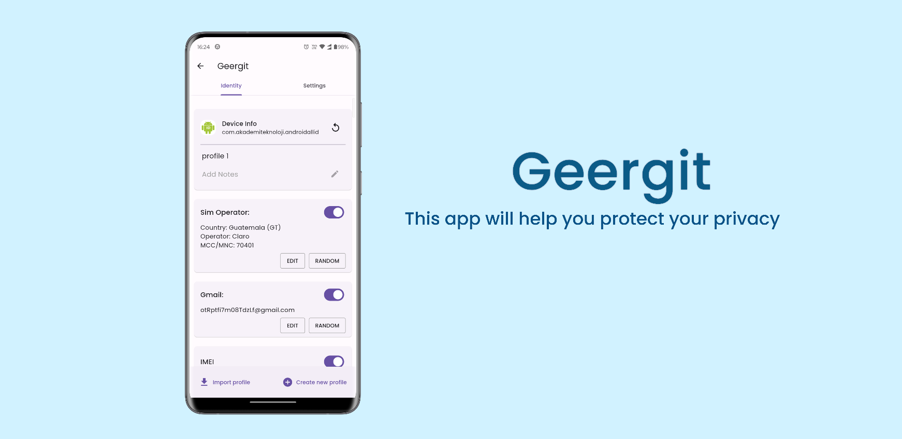

# Geergit - Protect Your Privacy

ROOT REQUIRED

XPOSED FRAMEWORK REQUIRED

IF You dont know What is XPOSED FRAMEWORK then do not try this application (it wont work).
To Know more about Xposed Read Here.
http://forum.xda-developers.com/xposed/
  

## IMPORTANT

- Although this app has been tested on several devices, there arealways chance something can go wrong. It is always recommended to have a backup of your ROM and other important data before trying this app.

This is Xposed Module For Changing (MASKING) the various IDs in the Phone.
Change means when an application access these parameters this appwill replace original value with user provided value. Original values are always intact in device.
  

## Pricing Table

| Features                                             | Freemium | Silver (Lifetime) | Premium (Subscription) | Alpha (Subscription) |
| ---------------------------------------------------- | -------- | ----------------- | ---------------------- | -------------------- |
| IMEI1                                                | ✔️       | ✔️                | ✔️                     | ✔️                   |
| IMEI2                                                | ✔️       | ✔️                | ✔️                     | ✔️                   |
| Hardware Serial                                      | ✔️       | ✔️                | ✔️                     | ✔️                   |
| Bluetooth Mac                                        | ✔️       | ✔️                | ✔️                     | ✔️                   |
| Wifi Mac                                             | ✔️       | ✔️                | ✔️                     | ✔️                   |
| Wifi SSID                                            | ✔️       | ✔️                | ✔️                     | ✔️                   |
| Mobile Number                                        | ✔️       | ✔️                | ✔️                     | ✔️                   |
| Advertising ID                                       | ✔️       | ✔️                | ✔️                     | ✔️                   |
| Country                                              |          | ✔️                | ✔️                     | ✔️                   |
| SIM Operator                                         |          | ✔️                | ✔️                     | ✔️                   |
| SIM MCC/MNC                                          |          | ✔️                | ✔️                     | ✔️                   |
| SIM Subscriber                                       |          | ✔️                | ✔️                     | ✔️                   |
| SIM Card Serial                                      |          | ✔️                | ✔️                     | ✔️                   |
| Google Service Framework (GSF)                       |          | ✔️                | ✔️                     | ✔️                   |
| Spoof Google Accounts (Gmail)                        |          | ✔️                | ✔️                     | ✔️                   |
| Android ID                                           |          |                   | ✔️                     | ✔️                   |
| DRM Media                                            |          |                   | ✔️                     | ✔️                   |
| On click random all the values                       |          |                   | ✔️                     | ✔️                   |
| Make device look more legit (hide root, xposed, etc) |          |                   |                        | ✔️                   |
| Mock location                                        |          |                   |                        | ✔️                   |
| Backup/Restore app data                              |          |                   |                        | ✔️                   |
| Create groups of target apps                         |          |                   |                        | ✔️                   |
| Profile creation per App and Group                   |          |                   |                        | ✔️                   |
| Add notes to profile                                 |          |                   |                        | ✔️                   |

**Freemium:** The Freemium membership provides essential features to enhance your privacy control on Android. With Freemium, you can protect your IMEI, hardware serial, Bluetooth MAC, Wi-Fi MAC, mobile number, advertising ID, and Wi-Fi SSID. It's a great starting point for securing your information.

**Silver (Lifetime):** Upgrade to the Silver membership and make a one-time payment to unlock advanced features. The Silver membership provides lifetime access to all the functionalities available in the Freemium plan, along with additional features. With Silver, you gain access to country information, SIM operator details, SIM MCC/MNC, SIM subscriber information, SIM card serial, Google Service Framework (GSF), and the ability to spoof Google accounts (Gmail). Silver expands your privacy control capabilities for a lifetime.

**Premium (Subscription):** Subscribe to the Premium membership and unlock everything provided in the Freemium and Lifetime plans. Additionally, as a Premium member, you gain access to upcoming features mentioned in the table above. With Premium, you stay up-to-date with the latest developments and enjoy comprehensive privacy control options. Premium membership is available through a subscription.

**Alpha (Subscription):** The Alpha membership encompasses all the features provided in the Freemium, Lifetime, and Premium plans. On top of that, Alpha offers advanced features that are still under development. These exclusive features are not available in the other plans and enable you to experience cutting-edge privacy control on your Android device. Alpha membership is available through a subscription.

Please note that the availability of certain features may vary depending on the membership level.

(_Note: Pricing plans are based on monthly per-device subscriptions. Prices and features are subject to change as Geergit is still under development._)

### Feature request

There are multiple methods to request feature

1. You can open feature request issue to this repository.
2. Submit this Google Form: https://forms.gle/X8sX6PcSi9bRbK1YA
3. [Telegram Group](https://t.me/geergit_xposed)
4. [XDA Thread](https://forum.xda-developers.com/t/app-xposed-5-0-13-geergit-a-module-to-protect-your-privacy.4573243/)

 

### NOTE:

1. For changes to take effect close all running applications alsoswipe / clear apps from recent list. No need to reboot.

Steps to enable app in Xposed Framework (LSPosed Recommended).

- Install app
- Go to xposed module
- Enable module in xposed framework
- Select target/victim apps in module's scope incase of LSPosed
- Restart phone
- Open the app
- And you can start using it by changing settings.

2. Don't use this app for any illegal purpose or cheat any program this module is just for better privacy.
     

Credits:

@DE - For inspiring me for this module.  
@Lsposed Team - For their efforts.  
@VD171 - for his app VDInfo which will help to check spoof values.
  

### End User Licence Agreement (EULA)

"THE SOFTWARE IS PROVIDED ON AN AS-IS AND AS-AVAILABLE BASIS. YOU AGREE THAT YOUR USE OF THE SOFTWARE AND OUR SERVICES WILL BE AT YOUR SOLE RISK. TO THE FULLEST EXTENT PERMITTED BY LAW, WE DISCLAIM ALL WARRANTIES, EXPRESS OR IMPLIED, IN CONNECTION WITH THE SOFTWARE AND YOUR USE THEREOF, INCLUDING, WITHOUT LIMITATION, THE IMPLIED WARRANTIES OF MERCHANTABILITY, FITNESS FOR A PARTICULAR PURPOSE, AND NON-INFRINGEMENT. IN NO EVENT WILL AUTHOR BE LIABLE FOR ANY DAMAGES CAUSED BY USING THIS PRODUCT"
